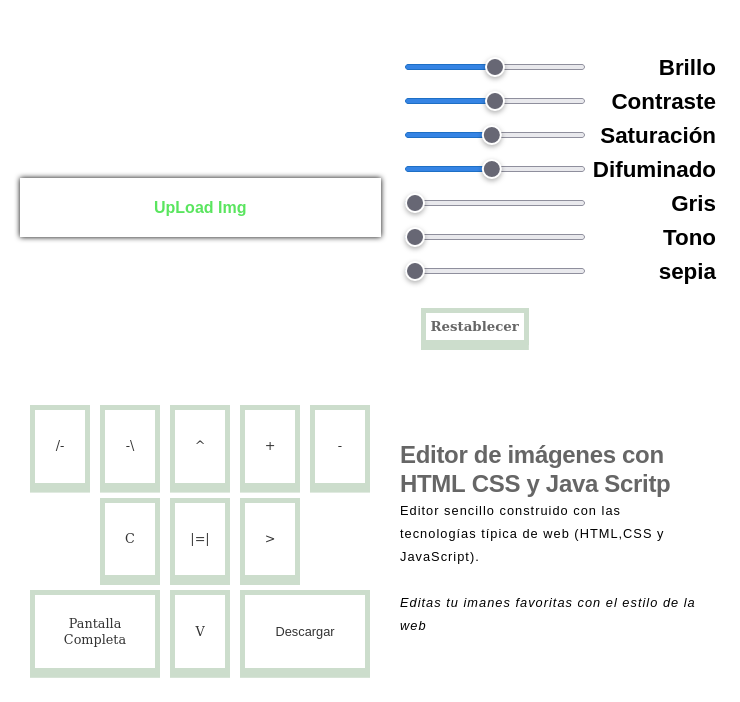

Editor de imagenes Web. 
========================

Un editor de imagenes sencillo contruido con los lenguajes basico de la web **HTML, CSS, JavaScript**

----

---

inicio rapido. 
-----------------------

esto es un proyecto de solo html, css y javaScript, para
ejecurtalo basta con hacer. 

`git clone https://github.com/Nefasque/imgEditor/edit/main/`

y abrilo con el navegador de su preferencia. 

-----------------

